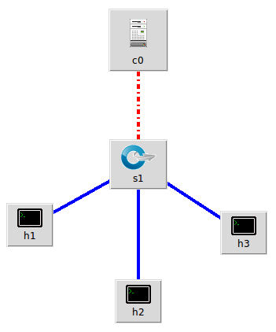
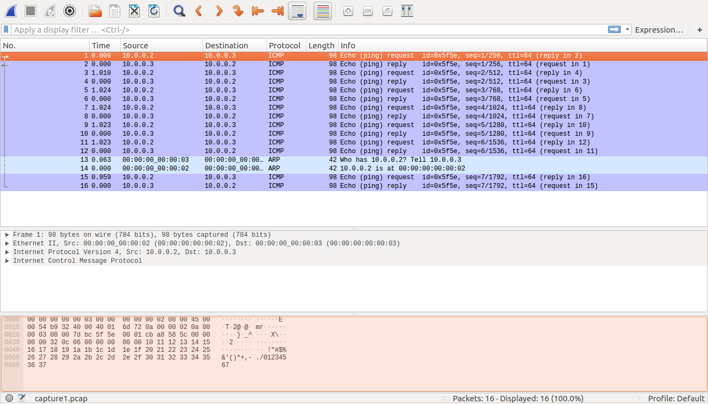
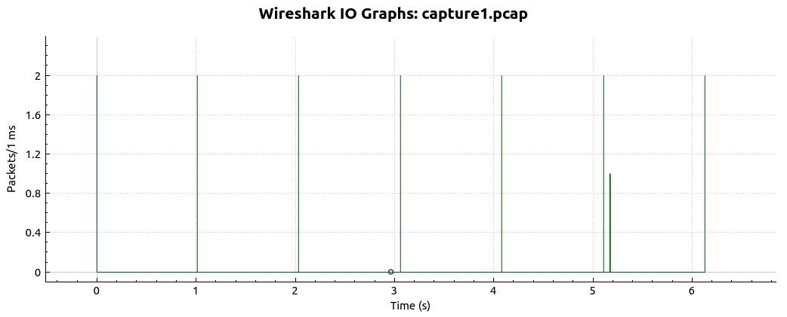
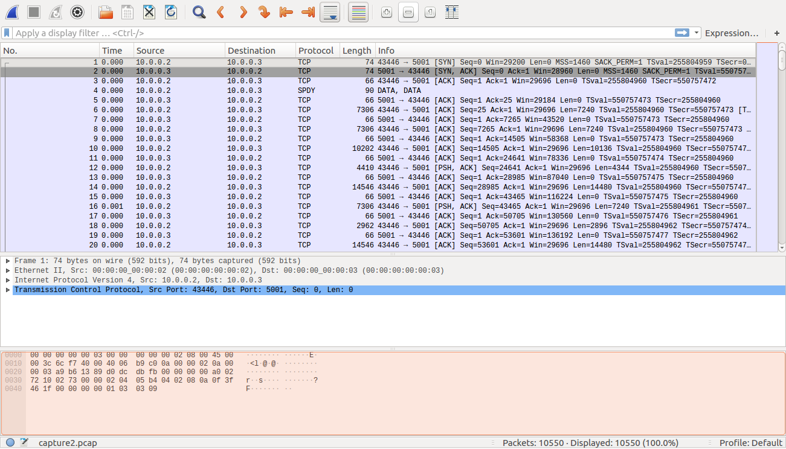
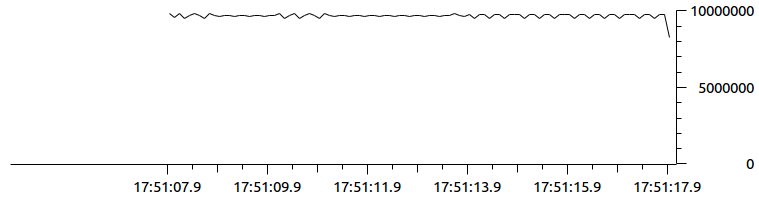

# Descripción esperimental #

## Sobre el experimento ##


### Herramientas empleadas ###

* **Hardware**:
    * Lenovo Z50 con ubuntu 16.04 LTS, con un procesador Intel Core i7 ...
* **Sofware empleado**:
    * [**Mininet**](http://mininet.org/overview/): emulador para la generación y desarrollo de pruebas en topologias de red en un PC.
    * **ping**: para la medición del RTT y packet delivery ratio.
    * **iperf**: para la medición del ancho de banda.
    * **hping3**: herramienta empleada para la generación de trafico de ataque.
    * **switch**: Openswitch
    * **Controladores**: Ryu y Faucet
  
### Topologia ###

A continuacion se muestra la topologia de test en su caso mas simple:



La siguiente tabla describe el papel de los host en el experimento:

| Host | Descripción | IP |
|------|-------------|-------------|
| h1   | Atacante    | 10.0.0.1    |
| h2   | Cliente    | 10.0.0.2    |
| h3   | Victima    | 10.0.0.3    |

En lo que respecta al switch y al controlador, se empleara OpenvSwitch y Ryu respectivamente. Las aplicaciones que se ejecutará en el controlador serán el [simple_switch_13.py](simple_switch_13.py) (para manejo de paquetes) y [ofctl_rest.py](ofctl_rest.py) (para obtención de estadisticas usando REST). Una vez clarificado el procedimiento de experimentación con Ryu se procederá a replicar las pruebas con Faucet.

### Protocolo de prueba manual ###

En este caso las pruebas se harian de modo manual empleando el cli de mininet. El protocolo seria el siguiente:
1. Iniciar el controlador:

```bash
sudo ryu-manager --verbose simple_switch_13.py ofctl_rest.py
```
2. Iniciar la topologia:

```bash
sudo mn --topo=single,3 --mac --switch=ovsk,protocols=OpenFlow13 --controller=remote,ip=127.0.0.1:6653  --link=tc,bw=100 
```

3. Realizar las pruebas en mininet una vez este se cargue:

```bash
containernet>
```

Algunos comandos utilizados simples:
1. **```pingall```**:

```bash
containernet> pingall
*** Ping: testing ping reachability
h1 -> h2 h3 
h2 -> h1 h3 
h3 -> h1 h2 
*** Results: 0% dropped (6/6 received)
```

2. **```h1 ping -c 10 -i 0.5 h2```** para hacer pruebas simples:

```bash
containernet>  h1 ping -c 10 -i 0.5 h2
PING 10.0.0.2 (10.0.0.2) 56(84) bytes of data.
64 bytes from 10.0.0.2: icmp_seq=1 ttl=64 time=0.317 ms
64 bytes from 10.0.0.2: icmp_seq=2 ttl=64 time=0.093 ms
64 bytes from 10.0.0.2: icmp_seq=3 ttl=64 time=0.109 ms
64 bytes from 10.0.0.2: icmp_seq=4 ttl=64 time=0.092 ms
64 bytes from 10.0.0.2: icmp_seq=5 ttl=64 time=0.096 ms
64 bytes from 10.0.0.2: icmp_seq=6 ttl=64 time=0.102 ms
64 bytes from 10.0.0.2: icmp_seq=7 ttl=64 time=0.093 ms
64 bytes from 10.0.0.2: icmp_seq=8 ttl=64 time=0.099 ms
64 bytes from 10.0.0.2: icmp_seq=9 ttl=64 time=0.092 ms
64 bytes from 10.0.0.2: icmp_seq=10 ttl=64 time=0.041 ms

--- 10.0.0.2 ping statistics ---
10 packets transmitted, 10 received, 0% packet loss, time 4627ms
rtt min/avg/max/mdev = 0.041/0.113/0.317/0.070 ms
```

De las mediciones 1 y 2 se pueden obtener metricas como el Packet delivery ratio y el RTT asociado al delay.

3. **```iperf```**:

```bash
containernet> iperf
*** Iperf: testing TCP bandwidth between h1 and h3 
*** Results: ['95.7 Mbits/sec', '96.8 Mbits/sec']
```

4. **```iperf h2 h3```**:
   
```bash
containernet> iperf h2 h3
*** Iperf: testing TCP bandwidth between h2 and h3 
*** Results: ['95.7 Mbits/sec', '96.8 Mbits/sec']
```

5. Uso de iperf empleando h2 como cliente iperf y h3 como servidor iperf (se acceden a cada una de las consolas con iperf **```xterm h2 h3```**):

    1. Arrancar el servidor iperf: 
   
        ```bash
        # Consola h3
        root@fuck-pc:~/Documents/tesis_2019-1/tests/febrero/04# iperf -s
        ------------------------------------------------------------
        Server listening on TCP port 5001
        TCP window size: 85.3 KByte (default)
        ------------------------------------------------------------

        ```

    2. Arrancar el cliente iperf:

        ```bash
        # Consola h2
        root@fuck-pc:~/Documents/tesis_2019-1/tests/febero/04# iperf -t 10 -i 1 -c 10.0.0.3
        ------------------------------------------------------------
        Client connecting to 10.0.0.3, TCP port 5001
        TCP window size: 85.3 KByte (default)
        ------------------------------------------------------------
        [ 16] local 10.0.0.2 port 36062 connected with 10.0.0.3 port 5001
        [ ID] Interval       Transfer     Bandwidth
        [ 16]  0.0- 1.0 sec  12.2 MBytes   103 Mbits/sec
        [ 16]  1.0- 2.0 sec  11.1 MBytes  93.3 Mbits/sec
        [ 16]  2.0- 3.0 sec  11.5 MBytes  96.5 Mbits/sec
        [ 16]  3.0- 4.0 sec  11.5 MBytes  96.5 Mbits/sec
        [ 16]  4.0- 5.0 sec  11.2 MBytes  94.4 Mbits/sec
        [ 16]  5.0- 6.0 sec  11.5 MBytes  96.5 Mbits/sec
        [ 16]  6.0- 7.0 sec  11.5 MBytes  96.5 Mbits/sec
        [ 16]  7.0- 8.0 sec  11.5 MBytes  96.5 Mbits/sec
        [ 16]  8.0- 9.0 sec  11.2 MBytes  94.4 Mbits/sec
        [ 16]  9.0-10.0 sec  11.5 MBytes  96.5 Mbits/sec
        [ 16]  0.0-10.0 sec   115 MBytes  96.3 Mbits/sec
        root@fuck-pc:~/Documents/tesis_2019-1/tests/febrero/04# 
        ```

De las mediciones asociadas con el iperf se pueden obtener el ancho de banda asociado con el link.

Notese ademas que aun no se ha metido trafico de red.

6. **```tcpdump```**: Tal y como se sugiere en [Cyberpaths - Network Traffic & Denial of Service Lab](http://mountrouidoux.people.cofc.edu/CyberPaths/networktrafficandddos.html) se puede emplear este comando para un analisis mas detallado, a continuación se describen los pasos:
    1. Arrancar tcpdump en la victima (h3):

    ```bash
    # Terminal h3

    tcpdump -i h3-eth0 -w capture1.pcap 
    ```

    2. Dar un ping desde el usuario (h2) a la victima (h3).

    ```bash
    # Terminal h2

    ping 10.0.0.3 
    ```
   
    3. Detener el ping y detener el tcpdump con CTRL + C (^C).

    ```bash
    # Terminal h2

    ...
    64 bytes from 10.0.0.3: icmp_seq=7 ttl=64 time=0.083 ms
    ^C
    --- 10.0.0.3 ping statistics ---
    7 packets transmitted, 7 received, 0% packet loss, time 6131ms
    rtt min/avg/max/mdev = 0.055/0.151/0.514/0.149 ms
    ```

    ```bash
    # Terminal h3

    ...
    tcpdump: listening on h3-eth0, link-type EN10MB (Ethernet), capture size 262144 bytes
    ^C16 packets captured
    16 packets received by filter
    0 packets dropped by kernel
    ```
       
    4. Leer la traza con tcpdump, tshark o wireshark.  

    ```bash
    # Terminal h3
    tcpdump -r capture1.pcap
    ...
    16:04:16.503382 IP 10.0.0.2 > 10.0.0.3: ICMP echo request, id 24414, seq 6, length 64
    16:04:16.503417 IP 10.0.0.3 > 10.0.0.2: ICMP echo reply, id 24414, seq 6, length 64
    16:04:16.567273 ARP, Request who-has 10.0.0.2 tell 10.0.0.3, length 28
    16:04:16.567751 ARP, Reply 10.0.0.2 is-at 00:00:00:00:00:02 (oui Ethernet), length 28
    16:04:17.527376 IP 10.0.0.2 > 10.0.0.3: ICMP echo request, id 24414, seq 7, length 64
    16:04:17.527399 IP 10.0.0.3 > 10.0.0.2: ICMP echo reply, id 24414, seq 7, length 64

    ```

    Con wireshark la cosa es mas o menos como sigue:

    

    En lo que respecta al grafico I/O, se tendrá:

    

### Analisis con ataques ###

Esta sección corresponde a la parte 4 **Part 4: Running an attack, observing user traffic, collecting and analyzing data** de [Cyberpaths - Network Traffic & Denial of Service Lab](http://mountrouidoux.people.cofc.edu/CyberPaths/networktrafficandddos.html). En el caso nuestro consistio en lo siguiente:

1. Arrancar el controlador.

```bash
sudo ryu-manager --verbose simple_switch_13.py ofctl_rest.py
```

2. Arrancar la topologia.

```bash
sudo mn --topo=single,3 --mac --switch=ovsk,protocols=OpenFlow13 --controller=remote,ip=127.0.0.1:6653  --link=tc,bw=100 
```

3. Ejecutar el servidor iperf en la victima (h3) a la cual se accede con **```xterm h3```**:

```bash
# Terminal h3
iperf -s
```

4. Ejecutar el cliente en la cliente (h2) a la cual se accede con **```xterm h2```**:

```bash
# Terminal h2
iperf -c 10.0.0.3
```

Hasta el momento las salidas de los comandos 3 y 4 son:

**Salida comando 3**:

```bash
# Terminal h3
root@fuck-pc:~/Documents/tesis_2019-1/tests/febrero/04# iperf -s
------------------------------------------------------------
Server listening on TCP port 5001
TCP window size: 85.3 KByte (default)
------------------------------------------------------------
```

**Salida comando 4**:

```bash
# Terminal h2
root@fuck-pc:~/Documents/tesis_2019-1/tests/febrero/04# iperf -c 10.0.0.3
------------------------------------------------------------
Client connecting to 10.0.0.3, TCP port 5001
TCP window size: 85.3 KByte (default)
------------------------------------------------------------
[ 16] local 10.0.0.2 port 42972 connected with 10.0.0.3 port 5001
[ ID] Interval       Transfer     Bandwidth
[ 16]  0.0-10.0 sec   115 MBytes  96.2 Mbits/sec
```

5. Cuando se obtenga el resultado en el cliente se puede suspender la ejecución h3 del servidor iperf con CTRL + C

```bash
# Terminal h3
root@fuck-pc:~/Documents/tesis_2019-1/tests/febrero/04# iperf -s
------------------------------------------------------------
Server listening on TCP port 5001
TCP window size: 85.3 KByte (default)
------------------------------------------------------------
[ 17] local 10.0.0.3 port 5001 connected with 10.0.0.2 port 42972
[ ID] Interval       Transfer     Bandwidth
[ 17]  0.0-10.1 sec   115 MBytes  95.6 Mbits/sec
```

**Analizando trafico de red**

6. Ejecutar el comando tcpdump en la interfaz de red que conecta el switch con la victima para analizar el trafico que pasa por alli. Se accede previamente a la consola del switch s1 con el comando **```xterm s1```**

```bash
# Terminal s1

sudo tcpdump -i s1-eth3 -vv -w capture2.pcap
```

7. Repetir los pasos 3 y 4:

```bash
# Terminal h3
iperf -s
```

```bash
# Terminal h2
iperf -c 10.0.0.3
```

Para el caso dado, las salidas fueron las siguientes:

```bash
# Terminal s1
sudo tcpdump -i s1-eth3 -vv -w capture2.pcap
tcpdump: listening on s1-eth3, link-type EN10MB (Ethernet), capture size 262144 bytes
^C10550 packets captured
10550 packets received by filter
0 packets dropped by kernel
root@fuck-pc:~/Documents/tesis_2019-1/tests/febrero/04# 
```

```bash
# Terminal h3
iperf -s
------------------------------------------------------------
Server listening on TCP port 5001
TCP window size: 85.3 KByte (default)
------------------------------------------------------------
[ 17] local 10.0.0.3 port 5001 connected with 10.0.0.2 port 43446
[ ID] Interval       Transfer     Bandwidth
[ 17]  0.0-10.1 sec   115 MBytes  95.6 Mbits/sec
```


```bash
# Terminal h1
iperf -c 10.0.0.3
------------------------------------------------------------
Client connecting to 10.0.0.3, TCP port 5001
TCP window size: 85.3 KByte (default)
------------------------------------------------------------
[ 16] local 10.0.0.2 port 43446 connected with 10.0.0.3 port 5001
[ ID] Interval       Transfer     Bandwidth
[ 16]  0.0-10.0 sec   115 MBytes  96.3 Mbits/sec
```

8. Analizar resultados: Para este caso, se abrio el archivo pcap en wireshark tal y como se muestra a continuación:



Analizando la grafica I/O se llega al siguiente resultado:



Como se puede ver de la grafica anterior se tiene un ancho de banda de 100 Mbps.


1. Ejecutar ping desde host h1. Se accede previamente a la consola del host h1 con el comando **```xterm h1```***

```bash
# Terminal h1
ping 10.0.0.3
```

5. Analizar los resultados despues de detener la aplicación de los comandos.

**Terminal h1**:

```bash
# Terminal h1

root@fuck-pc:~/Documents/tesis_2019-1/tests/febrero/04# ping 10.0.0.3
PING 10.0.0.3 (10.0.0.3) 56(84) bytes of data.
64 bytes from 10.0.0.3: icmp_seq=1 ttl=64 time=0.450 ms
64 bytes from 10.0.0.3: icmp_seq=2 ttl=64 time=0.117 ms
64 bytes from 10.0.0.3: icmp_seq=3 ttl=64 time=0.138 ms
64 bytes from 10.0.0.3: icmp_seq=4 ttl=64 time=0.154 ms
64 bytes from 10.0.0.3: icmp_seq=5 ttl=64 time=0.052 ms
64 bytes from 10.0.0.3: icmp_seq=6 ttl=64 time=0.131 ms
^C
--- 10.0.0.3 ping statistics ---
6 packets transmitted, 6 received, 0% packet loss, time 5116ms
rtt min/avg/max/mdev = 0.052/0.173/0.450/0.128 ms
root@fuck-pc:~/Documents/tesis_2019-1/tests/febrero/04# 
ping 10.0.0.3
```


**Terminal s1**:

```bash
# Terminal s1
sudo tcpdump -i s1-eth3 -vv
tcpdump: listening on s1-eth3, link-type EN10MB (Ethernet), capture size 262144 bytes
17:19:03.211645 IP (tos 0x0, ttl 64, id 15416, offset 0, flags [DF], proto ICMP (1), length 84)
    10.0.0.1 > 10.0.0.3: ICMP echo request, id 6312, seq 1, length 64
17:19:03.211686 IP (tos 0x0, ttl 64, id 58867, offset 0, flags [none], proto ICMP (1), length 84)
    10.0.0.3 > 10.0.0.1: ICMP echo reply, id 6312, seq 1, length 64
17:19:04.231470 IP (tos 0x0, ttl 64, id 15532, offset 0, flags [DF], proto ICMP (1), length 84)
    10.0.0.1 > 10.0.0.3: ICMP echo request, id 6312, seq 2, length 64
17:19:04.231514 IP (tos 0x0, ttl 64, id 58874, offset 0, flags [none], proto ICMP (1), length 84)
    10.0.0.3 > 10.0.0.1: ICMP echo reply, id 6312, seq 2, length 64
17:19:05.255504 IP (tos 0x0, ttl 64, id 15576, offset 0, flags [DF], proto ICMP (1), length 84)
    10.0.0.1 > 10.0.0.3: ICMP echo request, id 6312, seq 3, length 64
17:19:05.255559 IP (tos 0x0, ttl 64, id 58911, offset 0, flags [none], proto ICMP (1), length 84)
    10.0.0.3 > 10.0.0.1: ICMP echo reply, id 6312, seq 3, length 64
17:19:06.279505 IP (tos 0x0, ttl 64, id 15780, offset 0, flags [DF], proto ICMP (1), length 84)
    10.0.0.1 > 10.0.0.3: ICMP echo request, id 6312, seq 4, length 64
17:19:06.279566 IP (tos 0x0, ttl 64, id 59078, offset 0, flags [none], proto ICMP (1), length 84)
    10.0.0.3 > 10.0.0.1: ICMP echo reply, id 6312, seq 4, length 64
17:19:07.303374 IP (tos 0x0, ttl 64, id 15957, offset 0, flags [DF], proto ICMP (1), length 84)
    10.0.0.1 > 10.0.0.3: ICMP echo request, id 6312, seq 5, length 64
17:19:07.303393 IP (tos 0x0, ttl 64, id 59267, offset 0, flags [none], proto ICMP (1), length 84)
    10.0.0.3 > 10.0.0.1: ICMP echo reply, id 6312, seq 5, length 64
17:19:08.327515 IP (tos 0x0, ttl 64, id 16213, offset 0, flags [DF], proto ICMP (1), length 84)
    10.0.0.1 > 10.0.0.3: ICMP echo request, id 6312, seq 6, length 64
17:19:08.327560 IP (tos 0x0, ttl 64, id 59453, offset 0, flags [none], proto ICMP (1), length 84)
    10.0.0.3 > 10.0.0.1: ICMP echo reply, id 6312, seq 6, length 64
17:19:08.423329 ARP, Ethernet (len 6), IPv4 (len 4), Request who-has 10.0.0.1 tell 10.0.0.3, length 28
17:19:08.423732 ARP, Ethernet (len 6), IPv4 (len 4), Reply 10.0.0.1 is-at 00:00:00:00:00:01 (oui Ethernet), length 28
^C
14 packets captured
14 packets received by filter
0 packets dropped by kernel
```

### Metricas llevadas a cabo ###


### ###

## Referencias ##

1. [Cyberpaths - Network Traffic & Denial of Service Lab](http://mountrouidoux.people.cofc.edu/CyberPaths/networktrafficandddos.html)
2. [OpenState-SDN/ryu](https://github.com/OpenState-SDN/ryu/wiki/DDoS)
3. [DDoS Attack Detection in SDN-based VANET Architectures](https://projekter.aau.dk/projekter/files/239545035/Master_Thesis___DDoS_Attack_Detection_in_SDN_based_VANET_Architectures__group_1097.pdf)
4. [How to get the total number of openflow-related packets that are transmitted between controller and switches?](http://csie.nqu.edu.tw/smallko/sdn/openflow_pkts.htm)
5. [Mininet XTerm, TCP dump and iperf](http://windysdn.blogspot.com/2013/09/mininet-xterm-tcp-dump-and-iperf.html)
6. [Create a Learning Switch]((https://github.com/mininet/openflow-tutorial/wiki/Create-a-Learning-Switch#Verify_Hub_Behavior_with_tcpdump)
7. [CS244 ’13: LOW RATE TCP-TARGETED DOS ATTACK](https://reproducingnetworkresearch.wordpress.com/2013/03/13/cs-244-13-low-rate-tcp-targeted-dos-attack/)
8. [CS244 ’17: LOW-RATE TCP DOS ATTACKS](https://reproducingnetworkresearch.wordpress.com/2017/06/05/cs244-17-low-rate-tcp-dos-attacks/)
9. [Hping3](https://github.com/jkotrady/hping/wiki/Hping3)
10. [Hping3 Packet Grenade](https://gist.github.com/Erreinion/c810b9561ffa423cca01)
11. [detecting Dos attacks on mininet](https://seclists.org/snort/2016/q3/83)
12. [OpenState-SDN/ryu](https://github.com/OpenState-SDN/ryu/wiki/DDoS)
13. A Software Approach for Mitigation of DoS Attacks on SDN’s (Software-Defined Networks)
    1.  [Enlace 1](https://books.google.com.co/books?id=nHhqDwAAQBAJ&pg=PA338&lpg=PA338&dq=hping+dos+mininet&source=bl&ots=Et2tD5_m38&sig=ACfU3U2FcCLvdcgzplni51qgiqOeOMJd7g&hl=es&sa=X&ved=2ahUKEwiOyoLN26LgAhVyrlkKHT6-D1k4ChDoATACegQIBxAB#v=onepage&q=hping%20dos%20mininet&f=false)
    2.  [Enlace 2](https://github.com/mishra14/DDoSAttackMitigationSystem)
14. [kawaljeet024/DDOS-Attack-using-Entropy-method-in-SDN-environmnet](https://github.com/kawaljeet024/DDOS-Attack-using-Entropy-method-in-SDN-environmnet)
15. [wenjoseph/TCPDoS](https://github.com/wenjoseph/TCPDoS)
16. [krishnatejay/research  ](https://github.com/krishnatejay/research)
17. [rprabhuh/SDNDDoS](https://github.com/rprabhuh/SDNDDoS)
18. [Automatic Detection of Elephant flows through Openflow-based OpenvSwitch](http://trap.ncirl.ie/2873/1/spurthimallesh.pdf)
19. [pblanc5/Mininet-Simulated-DDOS](https://github.com/pblanc5/Mininet-Simulated-DDOS)
20. [omkarsuram/SDN-DDoS](https://github.com/omkarsuram/SDN-DDoS)
21. [Ryuretic](https://github.com/Ryuretic/RyureticLabs/wiki)
22. https://hackertarget.com/tcpdump-examples/
23. https://danielmiessler.com/study/tcpdump/
24. https://www.tecmint.com/12-tcpdump-commands-a-network-sniffer-tool/
    


