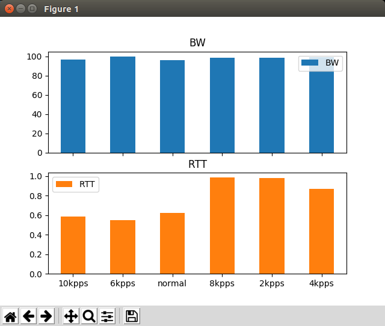

# Experimento #
----
## Topologia experimental ##

A continuación se muestra la topologia que se empleo para el experimento, asi mismo se resalta el trafico empleado para las pruebas:


Para el caso las herramientas empleadas para la generación de trafico fueron:
1. **Trafico de ataque (DoS)**: hping3
2. **Trafico de medicion**: iperf, ping.

## Pruebas basicas ##

### Prueba medicion del ping ###

1. Lanzar el controlador:

```bash
sudo ryu-manager --verbose simple_switch_13.py ofctl_rest.py
```

2. Lanzar el script de mininet:

```bash
sudo python tiempo.py
```

### Prueba medicion del del iperf ###

1. Lanzar el controlador:

```bash
sudo ryu-manager --verbose simple_switch_13.py ofctl_rest.py
```

2. Lanzar el script de mininet:

```bash
sudo python anchobanda.py
```

El resultado en ambos casos será un archivo de salida y su correspondiente version en **csv** para mas facil analisis.

## Prueba por partes ##

La jerarquia se muestra a continuacion:

```bash
.
├── controler_apps
│   ├── ofctl_rest.py
│   ├── simple_monitor_13.py
│   └── simple_switch_13.py
├── experimento
│   ├── lanzarExperimentos.py
│   ├── main.py
│   ├── metricas
│       ├── anchobanda.py
│       ├── __init__.py
│       ├── tiempo.py
│       └── tiempo.pyc
│   
├── README.md
└── reporte
    ├── analisis.py
   
```

### Parte 1 - Lanzar los experimentos ### 

1. Lanzar el controlador:

```bash
cd ./controler_apps
sudo ryu-manager --verbose simple_switch_13.py ofctl_rest.py
```

2. Lanzar los experimentos

```bash
cd ./experimento
sudo python lanzarExperimentos.py 
```

Como resultado se obterdra una carpeta (para el caso llamada **salidas**) con los resultados de cada uno de los experimentos ejecutados dentro de la carpeta **experimentos**. Esta tendra la siguiente forma:

```bash
salidas
    ├── 10kpps
    │   ├── iperf
    │   │   ├── iperf_ataque_10kpps_rep-1.out
    │   │   └── iperf_ataque_10kpps_rep-2.out
    │   └── ping
    │       ├── ping_ataque_10kpps_rep-1.out
    │       └── ping_ataque_10kpps_rep-2.out
    ├── 2kpps
    │   ├── iperf
    │   │   ├── iperf_ataque_2kpps_rep-1.out
    │   │   └── iperf_ataque_2kpps_rep-2.out
    │   └── ping
    │       ├── ping_ataque_2kpps_rep-1.out
    │       └── ping_ataque_2kpps_rep-2.out

    ...

```

Una vez se culmine el experimento se puede killear el controlador con **Ctrl + C**.

### Parte 2 - Obtener el reporte de los experimentos lanzados ### 

1. Antes de empezar se recomienda copiar la carpeta **salidas** dentro del directorio **reporte**. Asumiendo que nos encontramos en la carpeta **experimento**, el comando a aplicar sería el siguiente:

```bash
cp -rf salidas ../reporte
```

Con lo anterior la carpeta reporte tiene los siguientes archivos:

```bash
.
├── analisis.py
└── salidas
    ├── 10kpps
    │   ├── iperf
    │   │   ├── iperf_ataque_10kpps_rep-1.out
    │   │   └── iperf_ataque_10kpps_rep-2.out
    │   └── ping
    │       ├── ping_ataque_10kpps_rep-1.out
    │       └── ping_ataque_10kpps_rep-2.out
    ├── 2kpps
    │   ├── iperf
    │   │   ├── iperf_ataque_2kpps_rep-1.out
    │   │   └── iperf_ataque_2kpps_rep-2.out
    │   └── ping
    │       ├── ping_ataque_2kpps_rep-1.out
    │       └── ping_ataque_2kpps_rep-2.out

   ...
```

Como se puede ver ya se tienen los archivos resultantes de los experimentos y estos estan listos para el analisis.

2. Llevar a cabo el analisis de los resultados de la experimentacion:

```
python analisis.py
```

Tras la ejecución el resultado final. Por el momento será una grafica como la siguiente:



## Bugs ##

Hay problemas con la parte en la cual se lanzan los experimentos, pues a veces parece que el ataque no se viera materializado.

----
## ToDo ##

1. Corregir bug.
2. Agregar mas metricas.
3. Piede que bajar el ancho de banda de 100Mbps a otro valor menor muestre una mejor evidencia del impacto.

----
## Doing ##


----
## Done ##
1. Automatización del ataque y medidas (Muy basico).
2. Pruebas manuales (ver [enlace](https://github.com/tigarto/2019_test/blob/master/febrero/04/README.md))
3. Generando replicas para el ataque.
4. Colocar en el encabezado de los cvs las unidades.
5. Imprimir las estadisticas del ping (obtenidas del metodo que se hizo para ello)
6. Experimento completo, donde se hagan uso del paquete metricas creado.
7. Documentar.
8. Prueba lanzando un ataque despues de un tiempo determinado.
9. Hacer el programa para obtener estadisticas. 
   
----
## Notas ##
Lo que se lleva no esta libre de bugs.