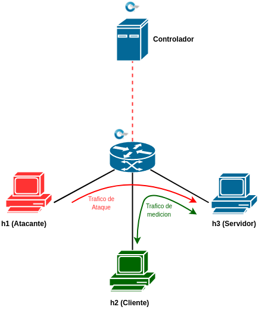
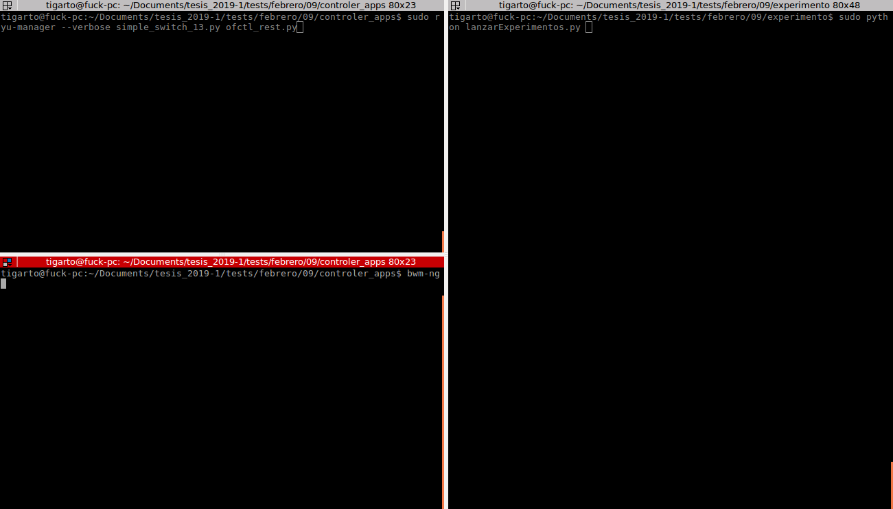
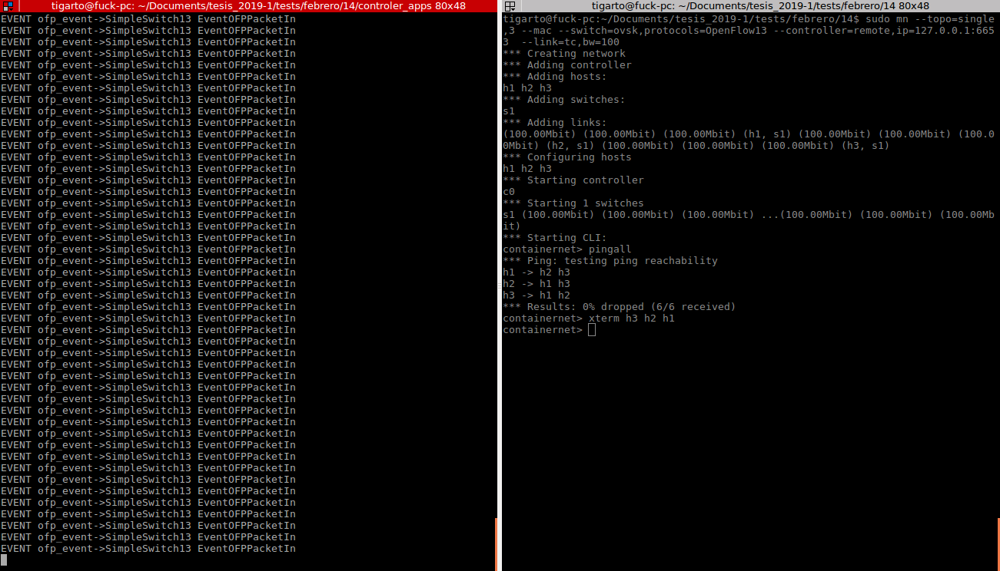
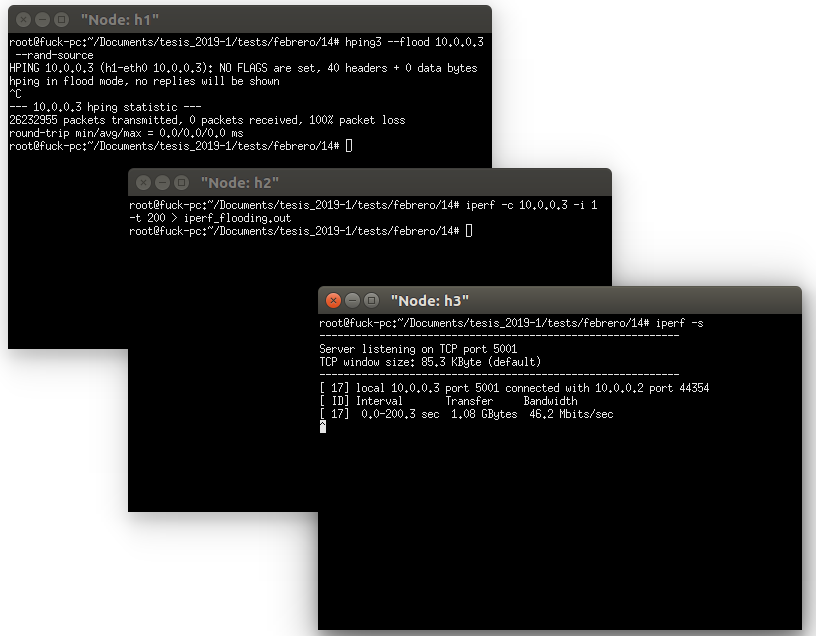

# Experimento manual #

## Topologia experimental ##

A continuación se muestra la topologia que se empleo para el experimento, asi mismo se resalta el trafico empleado para las pruebas:



Para el caso las herramientas empleadas para la generación de trafico fueron:
1. **Trafico de ataque (DoS)**: hping3
2. **Trafico de medicion**: iperf, ping.

### Lanzar la topologia test ###

1. Iniciar el controlador:

```bash
sudo ryu-manager --verbose simple_switch_13.py ofctl_rest.py
```

2. Iniciar la topologia:

```bash
sudo mn --topo=single,3 --mac --switch=ovsk,protocols=OpenFlow13 --controller=remote,ip=127.0.0.1:6653  --link=tc,bw=100 
```

3. Opcional (iniciar una aplicacion para el monitoreo de interfaces de red):

```bash
bwm-ng
```
La siguiente figura muestra el resultado de la aplicacion de estos comandos:





### Interactuar con la topologia ###

#### Mediciones ####

1. **Servidor iperf**:

```bash
iperf -f
```

2. **Cliente iperf**:

```bash
iperf -c IP_SERVIDOR -i INTERVALO -t TIEMPO_ANALISIS 
```

#### Ataque ####

1. **Ataque empleando una tasa fija**

```bash
hping3 -i INTERVALO IP_VICTIMA --rand-source
```

2. **Ataque por flooding**

```bash
hping3 --flood IP_VICTIMA --rand-source
```


#### Llevando a cabo las pruebas ####

1. **Elementos de la red**:
   1. **Atacante**: h1 (10.0.0.1)
   2. **Cliente iperf**: h2 (10.0.0.2)
   3. **Victima y servidor iperf**: h3 (10.0.0.3)

2. **Tasas de ataques**

| Velociad del ataque | Intervalo -i |
|----------|----------------|
| normal   | ---- |
| 2 kpps   | 500 us              |
| 4 kpps   | 250 us              |
| 6 kpps   | 166 us              |
| 8 kpps   | 125 us              |
| 10 kpps  | 100 us              |
| flood    | ----              |


3. Manos a la obra:

   1. Arrancar terminales:

   ```bash
   # Terminal de mininet
   xterm h1 h2 h3
   ```

   2. Arrancar servidor iperf:
   
   ```bash
   # Terminal de h3 (servidor iperf)
   iperf -s
   ```

   3. Lanzar el ataque:
      * Caso con tasa fija (abajo ejemplo para 2kpps):
  
         ```bash
         # Terminal de h1 atacante
         hping3 -i u500 10.0.0.3 --rand-source 
         ```
      
      * Caso por inundacion:
         
         ```bash
         # Terminal de h1 atacante
         hping3 --flood 10.0.0.3 --rand-source
         ```
    
    4. Arrancar el cliente iperf:

   ```bash
   # Terminal de h2 (cliente iperf)
   iperf -c 10.0.0.3 -i 1 -t 200 > iperf_2kpps.out
   ```

   Para el caso anterior, la medición se imprimirá cada 1s. y la captura durara aproximadamente 200s.

A continuación se muestran una de tantas formas como se pueden tener las terminales. La siguiente figura muestra las terminales del mininet (derecha) y del controlador (izquierda).



Por otro lado la siguiente figura muestra la imagen de los 3 host involucrados:



A continuación se muestran los comandos para cada uno de los test llevados a cabo a modo de resumen:

* **Test 1**: Ataque de 2kpps

```bash
# Terminal controlador
sudo ryu-manager --verbose simple_switch_13.py ofctl_rest.py

# Terminal mininet
sudo mn --topo=single,3 --mac --switch=ovsk,protocols=OpenFlow13 --controller=remote,ip=127.0.0.1:6653  --link=tc,bw=100

# Terminal h3
iperf -s

# Terminal h1
hping3 -i u500 10.0.0.3 --rand-source 

# Terminal h2
iperf -c 10.0.0.3 -i 1 -t 200 > iperf_2kpps.out
```

El resultado de la medición es un archivo de texto con la salida del comando iperf en el cliente. Para este caso el archivo se llama **iperf_2kpps.out**

* **Test 2**: Ataque de 4kpps

```bash
# Terminal controlador
sudo ryu-manager --verbose simple_switch_13.py ofctl_rest.py

# Terminal mininet
sudo mn --topo=single,3 --mac --switch=ovsk,protocols=OpenFlow13 --controller=remote,ip=127.0.0.1:6653  --link=tc,bw=100

# Terminal h3
iperf -s

# Terminal h1
hping3 -i u250 10.0.0.3 --rand-source 

# Terminal h2
iperf -c 10.0.0.3 -i 1 -t 200 > iperf_4kpps.out
```
El resultado de la medición es un archivo de texto con la salida del comando iperf en el cliente. Para este caso el archivo se llama **iperf_4kpps.out**

* **Test 3**: Ataque de 6kpps

```bash
# Terminal controlador
sudo ryu-manager --verbose simple_switch_13.py ofctl_rest.py

# Terminal mininet
sudo mn --topo=single,3 --mac --switch=ovsk,protocols=OpenFlow13 --controller=remote,ip=127.0.0.1:6653  --link=tc,bw=100

# Terminal h3
iperf -s

# Terminal h1
hping3 -i u166 10.0.0.3 --rand-source 

# Terminal h2
iperf -c 10.0.0.3 -i 1 -t 200 > iperf_6kpps.out
```

El resultado de la medición es un archivo de texto con la salida del comando iperf en el cliente. Para este caso el archivo se llama **iperf_6kpps.out**

* **Test 4**: Ataque de 8kpps

```bash
# Terminal controlador
sudo ryu-manager --verbose simple_switch_13.py ofctl_rest.py

# Terminal mininet
sudo mn --topo=single,3 --mac --switch=ovsk,protocols=OpenFlow13 --controller=remote,ip=127.0.0.1:6653  --link=tc,bw=100

# Terminal h3
iperf -s

# Terminal h1
hping3 -i u125 10.0.0.3 --rand-source 

# Terminal h2
iperf -c 10.0.0.3 -i 1 -t 200 > iperf_8kpps.out
```

El resultado de la medición es un archivo de texto con la salida del comando iperf en el cliente. Para este caso el archivo se llama **iperf_8kpps.out**

* **Test 5**: Ataque de 10kpps

```bash
# Terminal controlador
sudo ryu-manager --verbose simple_switch_13.py ofctl_rest.py

# Terminal mininet
sudo mn --topo=single,3 --mac --switch=ovsk,protocols=OpenFlow13 --controller=remote,ip=127.0.0.1:6653  --link=tc,bw=100

# Terminal h3
iperf -s

# Terminal h1
hping3 -i u100 10.0.0.3 --rand-source 

# Terminal h2
iperf -c 10.0.0.3 -i 1 -t 200 > iperf_10kpps.out
```

El resultado de la medición es un archivo de texto con la salida del comando iperf en el cliente. Para este caso el archivo se llama **iperf_10kpps.out**

* **Test 6**: Ataque de flooding

```bash
# Terminal controlador
sudo ryu-manager --verbose simple_switch_13.py ofctl_rest.py

# Terminal mininet
sudo mn --topo=single,3 --mac --switch=ovsk,protocols=OpenFlow13 --controller=remote,ip=127.0.0.1:6653  --link=tc,bw=100

# Terminal h3
iperf -s

# Terminal h1
hping3 --flood 10.0.0.3 --rand-source 

# Terminal h2
iperf -c 10.0.0.3 -i 1 -t 200 > iperf_flooding.out
```

El resultado de la medición es un archivo de texto con la salida del comando iperf en el cliente. Para este caso el archivo se llama **iperf_flood.out**


* **Test 7**: Caso normal (sin ataque)

```bash
# Terminal controlador
sudo ryu-manager --verbose simple_switch_13.py ofctl_rest.py

# Terminal mininet
sudo mn --topo=single,3 --mac --switch=ovsk,protocols=OpenFlow13 --controller=remote,ip=127.0.0.1:6653  --link=tc,bw=100

# Terminal h3
iperf -s

# Terminal h2
iperf -c 10.0.0.3 -i 1 -t 200 > iperf_normal.out
```

El resultado de la medición es un archivo de texto con la salida del comando iperf en el cliente. Para este caso el archivo se llama **iperf_normal.out**

## Referencias ##

Para el caso nos basamos en:
1. http://csie.nqu.edu.tw/smallko/sdn/iperf_mininet.htm
2. http://csie.nqu.edu.tw/smallko/sdn/lab9.htm
3. http://sedici.unlp.edu.ar/bitstream/handle/10915/67210/Documento_completo.pdf-PDFA.pdf?sequence=1
4. http://mountrouidoux.people.cofc.edu/CyberPaths/networktrafficandddos.html

## Pendiente ##

1. Diagrama de flujo con el proceso de experimentacion.
2. Graficas donde se lleva a cabo el analisis.