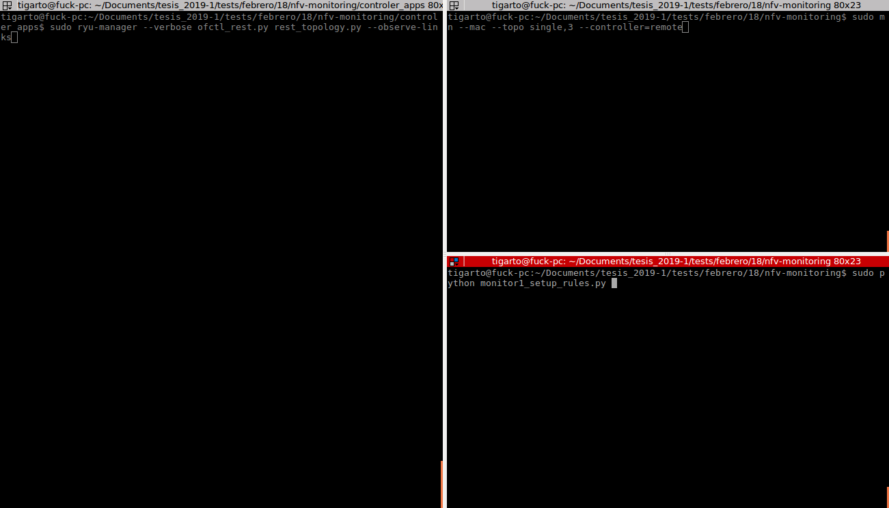
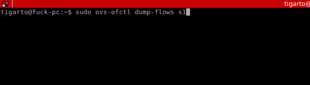

# Ejemplo - Monitor using Network Function Virtualization #

Este trabajo analiza el siguiente enlace: [Network Function Virtualization - monitor](http://csie.nqu.edu.tw/smallko/sdn/nfv_monitor.htm) siguiendo los pasos alli descritos.

**Nota**: Respecto a la instalacion de las reglas, se hizo un pequeño cambio con respecto a los json pasados como reglas pues en el documento se trabaja con la version 1.0 mientras en nuestro caso fue necesario trabajar con la version 1.3 de OpenFlow para que la cosa diera.

## Descripcion del problema ##

Ver: [Network Function Virtualization - monitor](http://csie.nqu.edu.tw/smallko/sdn/nfv_monitor.htm)

Para el caso se manejaron 3 scripts de python:
1. monitor1_setup_rules.py 
2. monitor2_divert_h2.py
3. monitor3_del_monitor.py  

La instalacion de las reglas se hizo por medio del: [ryu.app.ofctl_rest](https://ryu.readthedocs.io/en/latest/app/ofctl_rest.html) mediante envio de peticiones REST desde los scripts.

Debido a los siguientes tipos de mensajes involucrados en bueno repasar estructuras como:
1. [Action Structures](https://ryu.readthedocs.io/en/latest/ofproto_v1_0_ref.html#action-structures)
2. [Flow Match Structure](https://ryu.readthedocs.io/en/latest/ofproto_v1_0_ref.html#flow-match-structure)
3. [Send Packet Message](https://ryu.readthedocs.io/en/latest/ofproto_v1_0_ref.html#send-packet-message)
4. [Modify State Messages](https://ryu.readthedocs.io/en/latest/ofproto_v1_0_ref.html#modify-state-messages)

### Reglas instaladas ###

**script 1**: 
  
El script [monitor1_setup_rules.py](monitor1_setup_rules.py) es el encargado de instalar las reglas de la siguiente tabla:

| Regla | Campos |
|----------|----------------|
| 0        | priority=0,arp,actions=output:flood  |
| 1        | priority=10,icmp,in_port=1,actions=output:3|
| 2        | priority=10,icmp,in_port=3,actions=output:1|

A continuación se muestra la estructura enciada para cada regla anterior al emplear el [ryu.app.ofctl_rest](https://ryu.readthedocs.io/en/latest/app/ofctl_rest.html) el cual es empleado para la instalación de las reglas en el script

* **Regla 0**:

```json
curl -X POST -d '{
    "dpid": 1,
    "priority": 1,
    "match":{
        "dl_type":0x0806 
    },
    "actions":[
        {
            "type":"OUTPUT",
            "port": 0xFFFFFFFF
        }
    ]
 }' http://localhost:8080/stats/flowentry/add
 ```

* **Regla 1**:

```json
curl -X POST -d '{
    "dpid": 1,
    "priority": 10,
    "match":{
        "IP_PROTO":1,
        "in_port":1
    },
    "actions":[
        {
            "type":"OUTPUT",
            "port":3 
        }
    ]
 }' http://localhost:8080/stats/flowentry/add
 ```

* **Regla 2**:

 ```json
curl -X POST -d '{
    "dpid": 1,
    "priority": 10,
    "match":{
        "IP_PROTO":1,
        "in_port":3
    },
    "actions":[
        {
            "type":"OUTPUT",
            "port":1 
        }
    ]
 }' http://localhost:8080/stats/flowentry/add
 ```

**script 2**: 
  
El script [monitor2_divert_h2.py](monitor2_divert_h2.py) es el encargado de instalar las reglas de la siguiente tabla:

| Regla | Campos |
|----------|----------------|
| 0        | priority=0,arp,actions=output:flood  |
| 1        | priority=10,icmp,in_port=1,actions=output:3|
| 2        | priority=10,icmp,in_port=3,actions=output:1|
| **3**        | priority=20,in_port=1,icmp,actions=mod_dl_dst=00:00:00:00:00:02,output:2|
| **4**        | priority=20,in_port=2,icmp,dl_dst=00:00:00:00:00:03,output:3|
| **5**        | priority=20,in_port=3,icmp,actions=mod_dl_dst=00:00:00:00:00:02,output:2|
| **6**        | priority=20,in_port=2,icmp,dl_dst=00:00:00:00:00:01,output:1|

* **Regla 0**, **Regla 1** y **Regla 2**: Se definieron previamente:

* **Regla 3**:

```json
curl -X POST -d '{
    "dpid": 1,
    "priority": 20,
    "match":{
        "IP_PROTO":1,
        "in_port":1,
        "dl_dst": 00:00:00:00:00:03
    },
    "actions":[
        {
            "type": "SET_DL_DST",
            "mod_dl_dst": 00:00:00:00:00:02
        }, 
        {
            "type": "OUTPUT",
            "port":2
        }
    ]
 }' http://localhost:8080/stats/flowentry/add
 ```


* **Regla 4**:


```json
curl -X POST -d '{
    "dpid": 1,
    "priority": 20,
    "match":{
        "IP_PROTO":1,
        "in_port":1,
        "dl_dst": 00:00:00:00:00:03
    },
    "actions":[
        {
            "type": "OUTPUT",
            "port":3
        }
    ]
 }' http://localhost:8080/stats/flowentry/add
 ```

* **Regla 5**:

```json
curl -X POST -d '{
    "dpid": 1,
    "priority": 20,
    "match":{
        "IP_PROTO":1,
        "in_port":3,
        "dl_dst": 00:00:00:00:00:01
    },
    "actions":[
        {
            "type": "SET_DL_DST",
            "mod_dl_dst": 00:00:00:00:00:02
        }, 
        {
            "type": "OUTPUT",
            "port":2
        }
    ]
 }' http://localhost:8080/stats/flowentry/add
 ```

* **Regla 6**:

```json
curl -X POST -d '{
    "dpid": 1,
    "priority": 20,
    "match":{
        "IP_PROTO":1,
        "in_port":2,
        "dl_dst": 00:00:00:00:00:01
    },
    "actions":[
        {
            "type": "OUTPUT",
            "port":2
        }
    ]
 }' http://localhost:8080/stats/flowentry/add
 ```

### Procedimiento de test ###

Se siguen las instrucciones del enlace guia, sin embargo, aqui se muestran estas por pasos.

1. Arrancar el controlador:

```bash
# Terminal del controlador
sudo ryu-manager --verbose ofctl_rest.py rest_topology.py --observe-links
```

2. Arrancar la topologia:

```bash
# Terminal de mininet
sudo mn --mac --topo single,3 --controller=remote
```

La siguiente figura muestra la terminal para nuestro caso:



Donde:
* **Terminal Ryu**: Lado izquierdo.
* **Terminal Mininet**: Lado superior derecho.
* **Terminal para correr los scripts**: Lado inferior derecho.
  
Tambien opcionalmente se puede correr otra terminal para ver los flujos que son instalados en el switch a medida que se corren los scripts, este fue nuestro caso:

```bash
# Terminal de switch ovs
sudo ovs-ofctl dump-flows s1
```


La siguiente figura ilustra la salida del comando anterior antes de correr los scripts:

```bash
sudo ovs-ofctl dump-flows s1
NXST_FLOW reply (xid=0x4):
 cookie=0x0, duration=5.835s, table=0, n_packets=0, n_bytes=0, idle_age=5, priority=65535,dl_dst=01:80:c2:00:00:0e,dl_type=0x88cc actions=CONTROLLER:65535
```

4. Correr el script [monitor1_setup_rules.py](monitor1_setup_rules.py):

```bash
# Terminal de ejecución de los scripts
sudo python monitor1_setup_rules.py
```

La salida en el caso fue:

```bash
# Terminal de ejecución de los scripts
sudo python monitor1_setup_rules.py ls
add_flow_entry(dpid,match,priority,actions)
200
200
200
```

5. Verificar que se instalaron las reglas:

```bash
sudo ovs-ofctl dump-flows s1
NXST_FLOW reply (xid=0x4):
 cookie=0x0, duration=202.116s, table=0, n_packets=0, n_bytes=0, idle_age=202, priority=65535,dl_dst=01:80:c2:00:00:0e,dl_type=0x88cc actions=CONTROLLER:65535
 cookie=0x0, duration=60.500s, table=0, n_packets=0, n_bytes=0, idle_age=60, priority=10,in_port=1 actions=output:3
 cookie=0x0, duration=60.493s, table=0, n_packets=0, n_bytes=0, idle_age=60, priority=10,in_port=3 actions=output:1
```

6. Probar pingall y ping entre h1 y h3:

```bash
# Terminal mininet

# pingall
pingall
*** Ping: testing ping reachability
h1 -> X h3 
h2 -> X X 
h3 -> h1 X 
*** Results: 66% dropped (2/6 received)

# ping entre h1 y h3
h1 ping -c 1 h3
PING 10.0.0.3 (10.0.0.3) 56(84) bytes of data.
64 bytes from 10.0.0.3: icmp_seq=1 ttl=64 time=0.040 ms

--- 10.0.0.3 ping statistics ---
1 packets transmitted, 1 received, 0% packet loss, time 0ms
rtt min/avg/max/mdev = 0.040/0.040/0.040/0.000 ms
```

7. Abrir terminales para h1 y h2:

```bash
# Terminal mininet
xterm h1 h2
```

8. Arrancar el **tcpdump** en h2:

```bash
# Terminal h2
tcpdump
```

9. Ejecutar un pings continuos entre h1 y h3:

```bash
# Terminal h1
ping 10.0.0.3
```

10. Correr el script [monitor1_setup_rules.py](monitor1_setup_rules.py):

```bash
# Terminal de ejecución de los scripts
sudo python monitor2_divert_h2.py
```

h2 no escucha nada.


La salida en el caso fue:

```bash
# Terminal de ejecución de los scripts
sudo python monitor2_divert_h2.py 
add_flow_entry(dpid,match,priority,actions)
200
200
200
200
```

Si se verifican las reglas en el switch se tiene:

```bash
sudo ovs-ofctl dump-flows s1
NXST_FLOW reply (xid=0x4):
 cookie=0x0, duration=710.252s, table=0, n_packets=0, n_bytes=0, idle_age=710, priority=65535,dl_dst=01:80:c2:00:00:0e,dl_type=0x88cc actions=CONTROLLER:65535
 cookie=0x0, duration=34.461s, table=0, n_packets=33, n_bytes=3234, idle_age=1, priority=20,in_port=1,dl_dst=00:00:00:00:00:03 actions=output:2
 cookie=0x0, duration=34.458s, table=0, n_packets=0, n_bytes=0, idle_age=34, priority=20,in_port=2,dl_dst=00:00:00:00:00:03 actions=output:3
 cookie=0x0, duration=34.456s, table=0, n_packets=0, n_bytes=0, idle_age=34, priority=20,in_port=3,dl_dst=00:00:00:00:00:01 actions=output:2
 cookie=0x0, duration=34.453s, table=0, n_packets=0, n_bytes=0, idle_age=34, priority=20,in_port=2,dl_dst=00:00:00:00:00:01 actions=output:1
 cookie=0x0, duration=568.636s, table=0, n_packets=93, n_bytes=8610, idle_age=34, priority=10,in_port=1 actions=output:3
 cookie=0x0, duration=568.629s, table=0, n_packets=93, n_bytes=8610, idle_age=34, priority=10,in_port=3 actions=output:1
```

Ademas ya la terminal de h2 esta monitoreando.


11. Correr el script [monitor1_setup_rules.py](monitor1_setup_rules.py):

```bash
# Terminal de ejecución de los scripts
sudo python monitor3_del_monitor.py 
```

La salida en el caso fue:

```bash
# Terminal de ejecución de los scripts
sudo python monitor3_del_monitor.py 
delete_flow_entry(dpid, match=None, priority=None, actions=None)
200
200
200
200
```

Si se verifican las reglas en el switch se tiene:

```bash
sudo ovs-ofctl dump-flows s1
NXST_FLOW reply (xid=0x4):
 cookie=0x0, duration=887.932s, table=0, n_packets=0, n_bytes=0, idle_age=887, priority=65535,dl_dst=01:80:c2:00:00:0e,dl_type=0x88cc actions=CONTROLLER:65535
 cookie=0x0, duration=746.316s, table=0, n_packets=252, n_bytes=18088, idle_age=0, priority=10,in_port=1 actions=output:3
 cookie=0x0, duration=746.309s, table=0, n_packets=146, n_bytes=13636, idle_age=0, priority=10,in_port=3 actions=output:1
```

Asi mismo, h2 dejo de escuchar.

## Referencias ##

1. https://overlaid.net/2017/02/15/openflow-basic-concepts-and-theory/
2. http://flowgrammable.org/sdn/openflow/
3. https://ryu.readthedocs.io/en/latest/ofproto_v1_3_ref.html
4. https://github.com/t-lin/ryu_ofctl
5. https://inside-openflow.com/2016/07/21/ryu-api-dissecting-simple-switch/
6. https://www.programcreek.com/python/example/98148/ryu.ofproto.ofproto_v1_3.OFP_VERSION
7. http://www.openvswitch.org/support/dist-docs-2.5/tutorial/Tutorial.md.html

<!---


```python
def send_flow_mod(self, datapath):
    ofproto = datapath.ofproto
    ofp_parser = datapath.ofproto_parser
 	
    match = ofp_parser.OFPMatch(
                                 dl_type=0x0800
                               )    
    actions = [ofp_parser.OFPActionOutput(out_port = 3, ofp.OFPP_NORMAL, 0)]
    command = ofproto.OFPFC_ADD
    priority = 1
    req = ofp_parser.OFPFlowMod(
        datapath = datapath, match = match, command = command,
        priority = 1, actions)
    datapath.send_msg(req)
    self.logger.debug("Installing flow") 
```


```python
def send_flow_mod(self, datapath):
    ofp = datapath.ofproto
    ofp_parser = datapath.ofproto_parser

    cookie = cookie_mask = 0
    table_id = 0
    idle_timeout = hard_timeout = 0
    priority = 32768
    buffer_id = ofp.OFP_NO_BUFFER
    match = ofp_parser.OFPMatch(in_port=1, eth_dst='ff:ff:ff:ff:ff:ff')
    actions = [ofp_parser.OFPActionOutput(ofp.OFPP_NORMAL, 0)]
    inst = [ofp_parser.OFPInstructionActions(ofp.OFPIT_APPLY_ACTIONS,
                                             actions)]
    req = ofp_parser.OFPFlowMod(datapath, cookie, cookie_mask,
                                table_id, ofp.OFPFC_ADD,
                                idle_timeout, hard_timeout,
                                priority, buffer_id,
                                ofp.OFPP_ANY, ofp.OFPG_ANY,
                                ofp.OFPFF_SEND_FLOW_REM,
                                match, inst)
    datapath.send_msg(req)
```

-->
