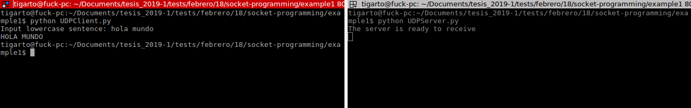

# Ejemplo sockets UDP #

El siguiente ejemplo es tomado del libro de **Computer Networking: A Top-Down Approach**. Mas exactamente el codigo fue tomado de las diapositivas [Chapter 2 Application Layer](https://mathcs.clarku.edu/~jmagee/cs280/slides/cs280.Ch2.Applications.CDN.SocketProgramming.pdf)

**Enunciado**:
En palabras del autor la siguiente aplicación permitira realizar la siguiente tarea:

Application Example:
1. client reads a line of characters (data) from its keyboard and sends data to server
2. server receives the data and converts characters to uppercase
3. server sends modified data to client
4. client receives modified data and displays line on its screen

El codigo asociado sera:

**Cliente**: [UDPClient.py](UDPClient.py)

```python
from socket import *

serverName = 'localhost'
serverPort = 12000

clientSocket = socket(AF_INET,SOCK_DGRAM)

message = raw_input('Input lowercase sentence:')
clientSocket.sendto(message.encode(),(serverName, serverPort))
modifiedMessage, serverAddress = clientSocket.recvfrom(2048)
print(modifiedMessage.decode())
clientSocket.close()
```

**Servidor**: [UDPServer.py](UDPServer.py)

```python
from socket import *

serverPort = 12000
serverSocket = socket(AF_INET, SOCK_DGRAM)

serverSocket.bind(('', serverPort))
print("The server is ready to receive")
while True:
    message, clientAddress = serverSocket.recvfrom(2048)
    modifiedMessage = message.decode().upper()
    serverSocket.sendto(modifiedMessage.encode(), clientAddress)
```

**Corriendo la aplicación**

1. Iniciar el servidor.

```bash
python UDPServer.py
```

2. Iniciar el cliente.

```bash
python UDPClient.py
```

3. Distrutar.

Una salida aproximada se muestra a continuación:



## Ejemplos adicionales ##

https://github.com/matheusMoreno/kurose-sockets


## Referencias ##

http://mathcs.pugetsound.edu/~tmullen/hw/s17nw/hw5/
https://mathcs.clarku.edu/~jmagee/cs280/slides/cs280.Ch2.Applications.CDN.SocketProgramming.pdf
https://github.com/matheusMoreno/kurose-sockets
https://www.cs.usfca.edu/~cruse/cs336s09/
http://mathcs.pugetsound.edu/~tmullen/hw/s17nw/hw5/
http://www.cs.rochester.edu/courses/257/fall2016/lectures/lecture-2.pdf
http://www.cs.cornell.edu/courses/cs4410/2018sp/schedule/slides/09-networking.pdf