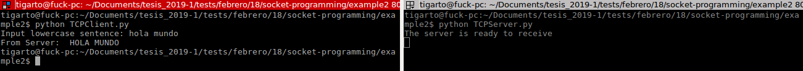

# Ejemplo sockets TCP #

El siguiente ejemplo es tomado del libro de **Computer Networking: A Top-Down Approach**. Mas exactamente el codigo fue tomado de las diapositivas [Chapter 2 Application Layer](https://mathcs.clarku.edu/~jmagee/cs280/slides/cs280.Ch2.Applications.CDN.SocketProgramming.pdf)

**Enunciado**:
En palabras del autor la siguiente aplicación permitira realizar la siguiente tarea:

Example client-server app:
1. client reads line from standard input (**inFromUser** stream), sends to server via socket (**outToServer** stream)
2. server reads line from socket
3. server converts line to uppercase, sends back to client
4. client reads, prints modified line from socket (**inFromServer** stream)

El codigo asociado sera:

**Cliente**: [TCPClient.py](TCPClient.py)

```python
from socket import *

serverName = 'localhost' # serverName = servername'

serverPort = 12000

clientSocket = socket(AF_INET, SOCK_STREAM)

clientSocket.connect((serverName,serverPort))
sentence = raw_input('Input lowercase sentence: ')
clientSocket.send(sentence.encode())
modifiedSentence = clientSocket.recv(1024)
print 'From Server: ', modifiedSentence.decode()
clientSocket.close()
```

**Servidor**: [TCPServer.py](TCPServer.py)

```python
from socket import *

serverPort = 12000

serverSocket = socket(AF_INET,SOCK_STREAM)
serverSocket.bind(('',serverPort))
serverSocket.listen(1)
print('The server is ready to receive')
while True:
    connectionSocket, addr = serverSocket.accept()
    sentence = connectionSocket.recv(1024).decode()
    capitalizedSentence = sentence.upper()
    connectionSocket.send(capitalizedSentence.encode())
    connectionSocket.close()
```

**Corriendo la aplicación**

1. Iniciar el servidor.

```bash
python TCPServer.py
```

2. Iniciar el cliente.

```bash
python TCPClient.py
```

3. Distrutar.

Una salida aproximada se muestra a continuación:



## Ejemplos adicionales ##

https://github.com/matheusMoreno/kurose-sockets


## Referencias ##

http://mathcs.pugetsound.edu/~tmullen/hw/s17nw/hw5/
https://mathcs.clarku.edu/~jmagee/cs280/slides/cs280.Ch2.Applications.CDN.SocketProgramming.pdf
https://github.com/matheusMoreno/kurose-sockets
https://www.cs.usfca.edu/~cruse/cs336s09/
http://mathcs.pugetsound.edu/~tmullen/hw/s17nw/hw5/
http://www.cs.rochester.edu/courses/257/fall2016/lectures/lecture-2.pdf
http://www.cs.cornell.edu/courses/cs4410/2018sp/schedule/slides/09-networking.pdf