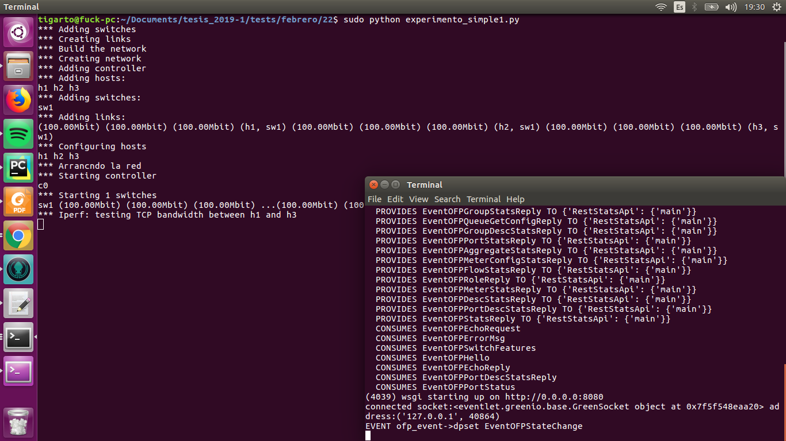
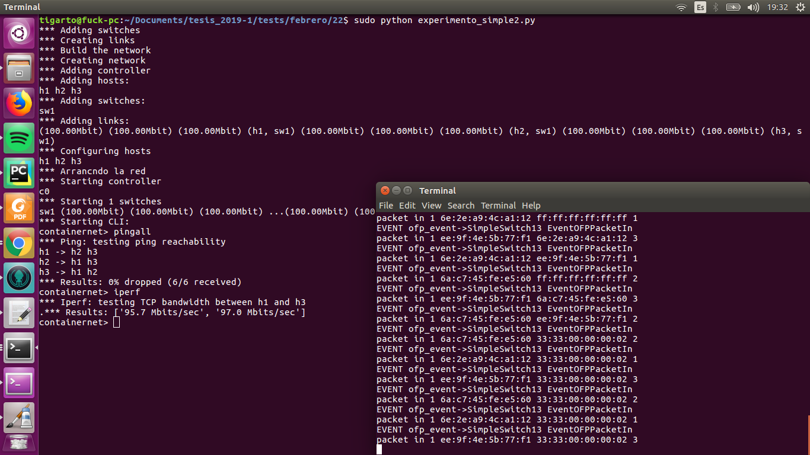

# Experimento #

* **Fecha**: 22/02/2019
* **Objetivo**: Automatizar en un script el lanzamiento del controlador y del mininet con miras a un proceso de automatización el cual, dado el caso, puede ahorrar el numero de comandos aplicados de dos (controlador + topologia) a uno (script que invoque estos dos). 

## Casos de test ##

### Caso 1 ###
Se invoco una topologia en mininet en la cual, se llevo a cabo una prueba iperf solamente. A continuación de muestra el comando de ejecución:

```bash
sudo python experimento_simple1.py
```
La salida mostrada fue algo similar a la siguiente figura:




**Código**: [experimento_simple1.py](experimento_simple1.py)

### Caso 2 ###
Se invoco una topologia en mininet en la que se invoco la consola para ejecutar los comandos que se desearan. A continuación de muestra el comando de ejecución:

```bash
sudo python experimento_simple2.py
```
La salida mostrada fue algo similar a la siguiente figura:



Notese la ejecución de comandos como ```pingall``` e ```iperf```.

**Código**: [experimento_simple2.py](experimento_simple2.py)